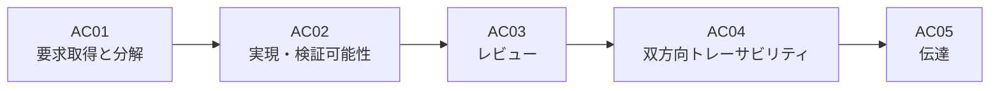
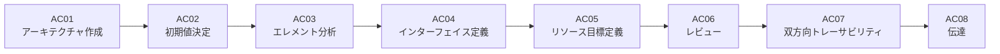

# MLE-book アクティビティ実行ガイド

MLE-bookドメインの**アクティビティ（AC）**を実行するためのガイドスキルです。  
各アクティビティはA-SPICE基本プラクティス（BP）に対応し、配下に具体的なタスク（TA）を持ちます。

---

## ドメイン階層

```
プロセス (MLE1, MLE2, ...)
  └── アクティビティ (AC)  ← このスキルが対象
       └── タスク (TA)
```

---

## アクティビティ実行ワークフロー

### ステップ 1: 対象アクティビティの特定

ユーザーに以下を確認する：
1. **対象プロセス**: MLE1（要求分析）/ MLE2（アーキテクチャ）/ ...
2. **対象アクティビティID**: 例 `MLE1.AC01`
3. **前提条件の確認**: 前工程のアクティビティが完了しているか（例：MLE1完了後にMLE2, SUP11が動く等）

### ステップ 2: アクティビティ情報の参照

対象プロセスの詳細リファレンスを参照する：
- MLE1の場合: `references/mle1-activities.md` を参照
- MLE2の場合: `references/mle2-activities.md` を参照
- SUP11の場合: `references/sup11_activities.md` を参照

以下の情報を確認する：
- **対応BP**: A-SPICE基本プラクティスとの対応
- **アクティビティ内容**: 作業の概要
- **配下タスク一覧**: 実施すべきタスクのリスト
- **入力成果物**: 必要な入力
- **出力成果物**: 期待される出力

### ステップ 3: 配下タスクの順次実行

アクティビティ配下のタスクを順番に実行する。  
各タスクの詳細は **mle-task** スキルを参照。

```
アクティビティ: MLE1.AC01（機械学習要求の取得と分解）
  ├── MLE1.TA0101: 機械学習要件を取得する
  ├── MLE1.TA0102: 機械学習要件を分解する
  └── MLE1.TA0103: 検討した要件を表にまとめる
```

### ステップ 4: 完了確認

- [ ] 全タスクが完了したか
- [ ] 出力成果物が生成されたか
- [ ] 次のアクティビティへの入力が準備できたか

---

## MLE1 アクティビティ一覧

| ID | 内容 | 対応BP | タスク数 |
|---|---|---|---|
| MLE1.AC01 | 機械学習要求の取得と分解 | BP1 | 3 |
| MLE1.AC02 | 実現・検証可能性の検証と統合 | BP2, BP3 | 5 |
| MLE1.AC03 | レビュー | PLG1 | 1 |
| MLE1.AC04 | 双方向トレーサビリティ | BP4 | 1 |
| MLE1.AC05 | 機械学習要件の伝達 | BP5 | 1 |

詳細: `references/mle1-activities.md` を参照

---

## MLE2 アクティビティ一覧

| ID | 内容 | 対応BP | タスク数 |
|---|---|---|---|
| MLE2.AC01 | MLアーキテクチャを作成する | BP1 | 4 |
| MLE2.AC02 | 初期値を決定する | BP2 | 2 |
| MLE2.AC03 | エレメントを分析する | BP3 | 2 |
| MLE2.AC04 | インターフェイスを定義する | BP4 | 2 |
| MLE2.AC05 | リソース目標を定義する | BP5 | 2 |
| MLE2.AC06 | レビュー | PLG1 | 5 |
| MLE2.AC07 | 双方向トレーサビリティ | BP5 | 6 |
| MLE2.AC08 | MLアーキテクチャの伝達 | BP6 | 1 |

詳細: `references/mle2-activities.md` を参照

---

## SUP11 アクティビティ一覧

| ID | 内容 | 対応BP | タスク数 |
|---|---|---|---|
| SUP11.AC01 | MLデータ管理システムの確立 | BP1 | 7 |
| SUP11.AC02 | MLデータの品質アプローチの作成 | BP2 | 7 |
| SUP11.AC03 | MLデータの収集 | BP3 | 3 |
| SUP11.AC04 | MLデータの処理 | BP4 | 3 |
| SUP11.AC05 | MLデータの品質保証 | BP5 | 2 |
| SUP11.AC06 | 合意された処理済のMLデータの伝達 | BP6 | 1 |

詳細: `references/sup11_activities.md` を参照

---

## アクティビティの実行順序

### MLE1 実行順序



> **注意**: AC04（双方向トレーサビリティ）はレビュー（AC03）の後工程とする。レビューによる出戻りを防ぐため。

### MLE2 実行順序


