```table-of-contents
title: 
style: nestedList # TOC style (nestedList|nestedOrderedList|inlineFirstLevel)
minLevel: 0 # Include headings from the specified level
maxLevel: 0 # Include headings up to the specified level
include: 
exclude: 
includeLinks: true # Make headings clickable
hideWhenEmpty: false # Hide TOC if no headings are found
debugInConsole: false # Print debug info in Obsidian console
```
(作成)2026.02.02
(更新)2026.03.09
# Why，モチベーション，目的：
A－Spice4.0 PAMを生成AIで解析したところ，MLEプロセスを"開発する機能にAIを搭載するプロセス"と認識した。
組込を考えた場合AI搭載は現実的ではない。
そこで本件では，開発プロセスにAIを使用するプロセスへテーラリングする。


![[image.png]](../img/image.png)
図.Automotive-SPICE-PAM_40_Japanese-1 Automotive-SPICE プロセス参照モデルの概要

参考文献![[MLE-Book/knowledge/Automotive-SPICE-PAM_40_Japanese-1.pdf]]

# A-Spice
## A-spice4.0ドメイン（抽象）
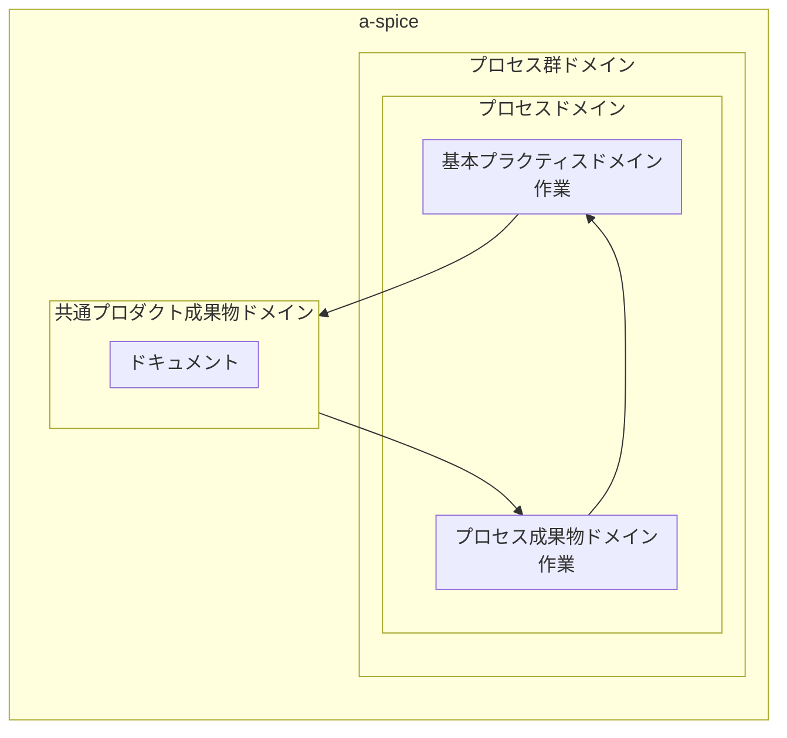
<div style="text-align: center;">
図，A－Spiceのドメインアーキテクチャと，MLE-bookのドメインアーキテクチャの関係
</div>

### A-spice MLE-機械学習エンジニアリングプロセス群ドメイン
MLEプロセスは，SYS,SWE,MANを代替できるように定義される。
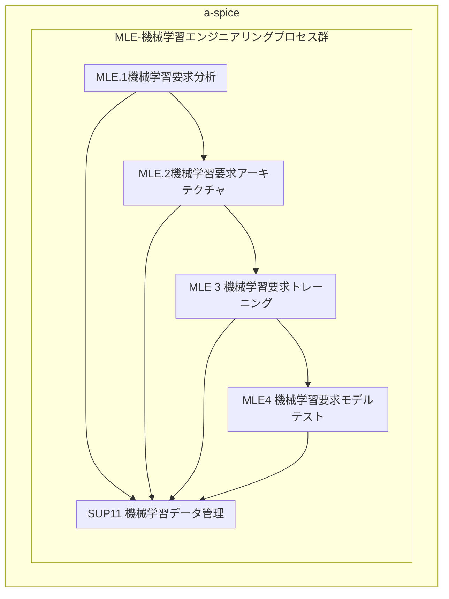
<div style="text-align: center;">
図，MLEプロセス群のアーキテクチャ
</div>

#### MLE1ドメイン
<div style="text-align: center;">
表，MLE1のプロセス成果物と基本プラクティス
</div>

|A-Spice共通プロダクト成果物|プロセス成果ID|プロセス成果概要|基本プラクティスID|基本プラクティス概要|
|--|--|--|--|--|
|17-00要求|MLE1.PRD1|仕様化されている|MLE1.BP1|仕様化する|
|17-00要求|MLE1.PRD2|優先順位が付けられている|MLE1.BP2|優先順位をつける|
|17-54要求の属性|MLE1.PRD2|優先順位が付けられている|MLE1.BP2|優先順位をつける|
|17-54要求の属性|MLE1.PRD3|分析されている|MLE1.BP3|分析する|
|13-52情報伝達の証拠|MLE1.PRD6|伝達されている|MLE1.BP5|伝達する|
|13-51一貫性の証拠|MLE1.PRD5|双方向トレーサビリティが確立されている|MLE1.BP4|双方向トレーサビリティを確立する|
|15-51分析結果|MLE1.PRD3|分析されている|MLE1.BP3|分析する|
|15-51分析結果|MLE1.PRD4|運用環境が検討されている|MLE1.BP4|運用環境を検討する|
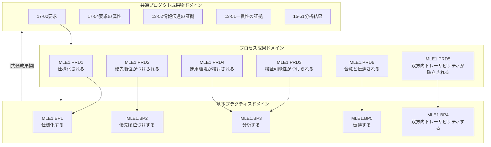

図，MLE1のプロセス成果物と基本プラクティスの関係

#### MLE2ドメイン
<div style="text-align: center;">
表，MLE2のプロセス成果物と基本プラクティス
</div>

| A-Spice共通プロダクト成果物 | プロセス成果ID  | プロセス成果概要                      | 基本プラクティスID | 基本プラクティス概要                 |
| ----------------- | --------- | ----------------------------- | ---------- | -------------------------- |
| 04-51MLアーキテクチャ    | MLE2.PRD1 | MLアーキテクチャが作成されている             | MLE2.BP1   | MLアーキテクチャを作成する             |
| 04-51MLアーキテクチャ    | MLE2.PRD2 | MLアーキテクチャの初期値が決定されている         | MLE2.BP2   | MLアーキテクチャの初期値を決定する         |
| 04-51MLアーキテクチャ    | MLE2.PRD3 | MLアーキテクチャが評価されている             | MLE2.BP3   | MLアーキテクチャを分析する             |
| 04-51MLアーキテクチャ    | MLE2.PRD4 | MLアーキテクチャのインターフェイスが定義されている    | MLE2.BP4   | MLアーキテクチャのインターフェイスを定義する    |
| 04-51MLアーキテクチャ    | MLE2.PRD5 | MLアーキテクチャのリソース消費目標が定義されている    | MLE2.BP5   | MLアーキテクチャのリソース消費目標を定義する    |
| 13-51一貫性の証拠       | MLE2.PRD6 | MLアーキテクチャの双方向トレーサビリティが確立されている | MLE2.BP6   | MLアーキテクチャの双方向トレーサビリティを確立する |
| 13-52情報伝達の証拠      | MLE2.PRD7 | MLアーキテクチャが伝達されている             | MLE2.BP7   | MLアーキテクチャを伝達する             |
| 01-54ハイパーパラメータ    | MLE2.PRD1 | MLアーキテクチャが作成されている             | MLE2.BP1   | MLアーキテクチャを作成する             |
| 01-54ハイパーパラメータ    | MLE2.PRD2 | MLアーキテクチャの初期値が決定されている         | MLE2.BP2   | MLアーキテクチャの初期値を決定する         |
| 15-51分析結果         | MLE2.PRD1 | MLアーキテクチャが作成されている             | MLE2.BP3   | MLアーキテクチャを分析する             |
| 15-51分析結果         | MLE2.PRD3 | MLアーキテクチャが評価されている             | MLE2.BP3   | MLアーキテクチャを分析する             |

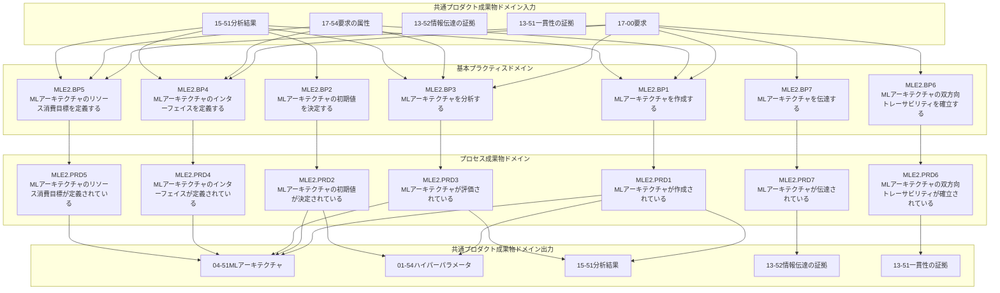
<div style="text-align: center;">
図，MLE2のプロセス成果物と基本プラクティスの関係
</div>


#### MLE3ドメイン
<div style="text-align: center;">
表，MLE3のプロセス成果物と基本プラクティス
</div>

| A-Spice共通プロダクト成果物 | プロセス成果ID | プロセス成果概要 | 基本プラクティスID | 基本プラクティス概要 |
| :--- | :--- | :--- | :--- | :--- |
| 01-53 トレーニング済のMLモデル | MLE3.PRD1 | MLモデルがトレーニングされている | MLE3.BP1 | MLモデルをトレーニングする |
| 15-52 検証結果 | MLE3.PRD2 | トレーニング実績が検証されている | MLE3.BP2 | MLモデルを検証する |
| 13-51 一貫性の証拠 | MLE3.PRD3 | 双方向トレーサビリティが確立されている | MLE3.BP3 | 双方向トレーサビリティを確立する |
| 13-52 情報伝達の証拠 | MLE3.PRD4 | トレーニング結果が伝達されている | MLE3.BP4 | トレーニング結果を伝達する |

#### MLE4ドメイン
<div style="text-align: center;">
表，MLE4のプロセス成果物と基本プラクティス
</div>

| A-Spice共通プロダクト成果物 | プロセス成果ID | プロセス成果概要 | 基本プラクティスID | 基本プラクティス概要 |
| :--- | :--- | :--- | :--- | :--- |
| 08-64 MLテストのアプローチ | MLE4.PRD1 | MLテストが仕様化されている | MLE4.BP1 | MLテストを仕様化する |
| 08-58 検証手段選定一式 | MLE4.PRD2 | MLテストが選定されている | MLE4.BP2 | MLテストを選定する |
| 11-50 デプロイ用のMLモデル | MLE4.PRD3 | MLモデルがテストされている | MLE4.BP3 | MLモデルをテストする |
| 13-50 MLテスト結果 | MLE4.PRD3 | MLモデルがテストされている | MLE4.BP3 | MLモデルをテストする |
| 15-52 検証結果 | MLE4.PRD4 | テスト結果が検証されている | MLE4.BP4 | MLモデルを検証する |
| 13-51 一貫性の証拠 | MLE4.PRD5 | 双方向トレーサビリティが確立されている | MLE4.BP5 | 双方向トレーサビリティを確立する |
| 13-52 情報伝達の証拠 | MLE4.PRD6 | テスト結果が伝達されている | MLE4.BP6 | テスト結果を伝達する |

#### SUP11ドメイン

表，SUP11のプロセス成果物と基本プラクティス

| A-Spice共通プロダクト成果物    | プロセス成果ID   | プロセス成果概要                                   | 基本プラクティスID | 基本プラクティス概要          |
| -------------------- | ---------- | ------------------------------------------ | ---------- | ------------------- |
| 16-52 ML データ管理システム   | SUP11.PRD1 | ML データのライフサイクルを含む ML データ管理システムが確立          | SUP11.BP1  | ML データ管理システムの確立     |
| 19-50 ML データの品質アプローチ | SUP11.PRD2 | ML データの品質基準を含む ML データの品質アプローチ              | SUP11.BP2  | ML データの品質アプローチの作成   |
| 03-53 ML データ         | SUP11.PRD3 | 収集された ML データが、ML データ要求と整合するように処理           | SUP11.BP3  | ML データの収集           |
| 03-53 ML データ         | SUP11.PRD3 | 収集された ML データが、ML データ要求と整合するように処理           | SUP11.BP4  | ML データの処理           |
| 03-53 ML データ         | SUP11.PRD4 | ML データが、定義された ML データの品質基準に対して検証され、必要に応じて更新 | SUP11.BP5  | ML データの品質保証         |
| 13-52 情報伝達の証拠        | SUP11.PRD5 | ML データが合意され、影響を受けるすべての関係者へ伝達               | SUP11.BP6  | 合意された処理済の ML データの伝達 |
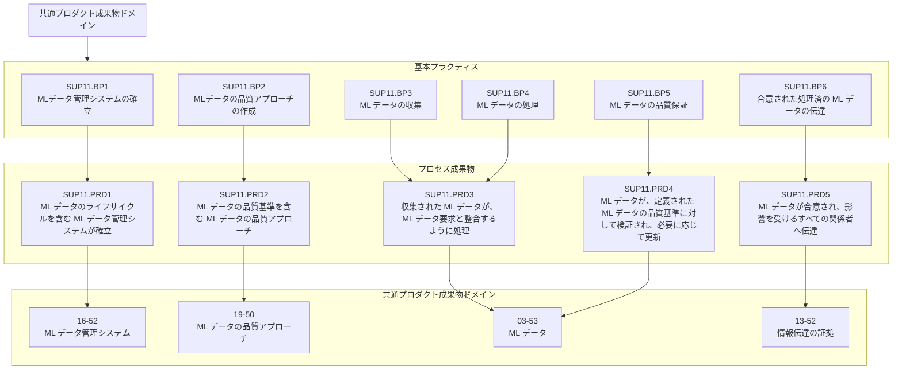
# MLE-Book
## MLE-bookドメイン(抽象)
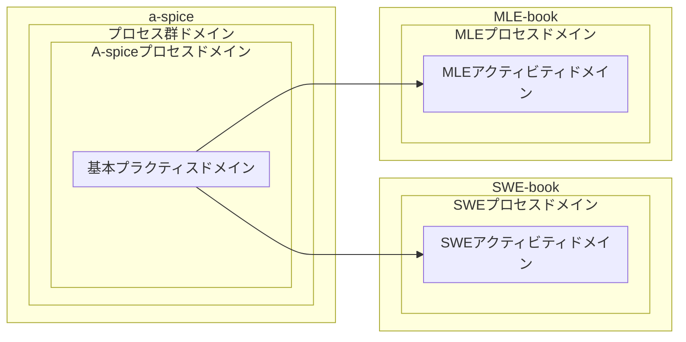

### MLE-bookとA-SpiceとMEL-bookプラグインのドメイン関係
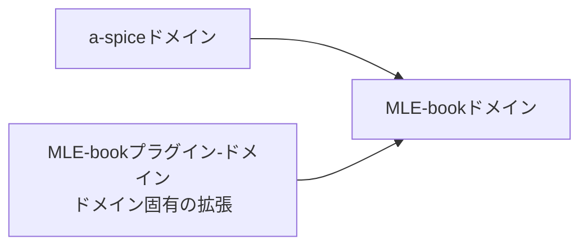
<div style="text-align: center;">
図，MLE-bookの抽象アーキテクチャ
</div>

## MLE-book プラグイン-ドメイン
プロジェクトは，プラグインの有無を選択できる。
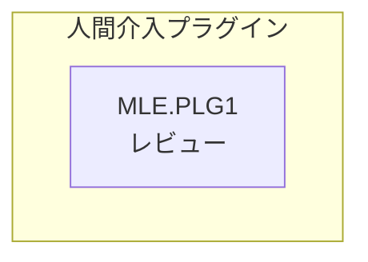
<div style="text-align: center;">
図，MLE-bookのプラグインアーキテクチャ
</div>

## MLE-book ドメイン
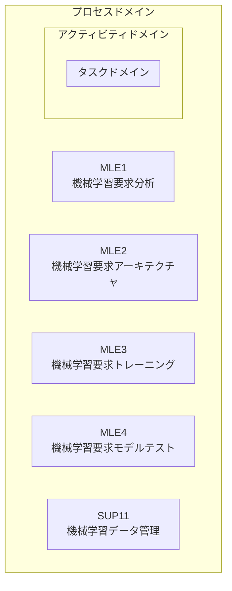
<div style="text-align: center;">
図，MLE-bookのドメインアーキテクチャ
</div>


### MLE1-アクティビティ-ドメイン

<div style="text-align: center;">
表，MLE1の基本プラクティスとアクティビティ
</div>

| 基本プラクティスID | 基本プラクティス内容        | アクティビティID            | アクティビティ内容         |
| ---------- | ----------------- | -------------------- | ----------------- |
| MLE1.BP1   | 仕様化               | MLE1.AC01            | 機械学習要求を取得し分解する。   |
| MLE1.BP2   | 運用環境              | MLE1.AC02            | 機械学習要求の実現環境を検討する。 |
| MLE1.BP3   | 優先順位              |                      |                   |
| MLE1.BP4   | 機械学習要求の検証可能性を検討する | MLE1.AC02            | 機械学習要求の検証可能性を検討する |
| MLE1.PLG1  | AC1とAC2をレビューする    | MLE1.AC03            | AC1とAC2をレビューする    |
| MLE1.BP4   || MLE1.AC04         | 双方向トレーサビリティを確立する[*1] |                   |
| MLE1.BP5   || MLE1.AC05         | 機械学習要件を伝達する          |                   |

*1: 双方向トレーサビリティは，レビューによる出戻りを防ぐため，レビューの後工程とする。

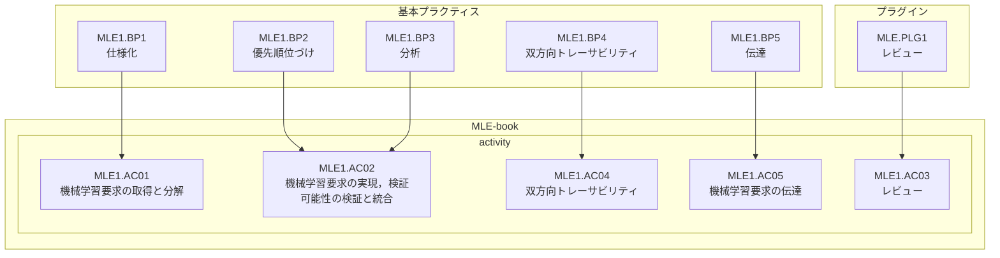
<div style="text-align: center;">
図，MLE1の基本プラクティスとactivityの関係
</div>

#### MLE1.アクティビティ01-ドメイン

| アクティビティID | アクティビティ内容    | タスクID       | タスク内容                      |
| --------- | ------------ | ----------- | -------------------------- |
| MLE1.AC01 | 機械学習要件の取得と分解 | MLE1.TA0101 | 機械学習要件を取得する                |
| MLE1.AC01 | 機械学習要件の取得と分解 | MLE1.TA0102 | 機械学習要件を分解する                |
| MLE1.AC01 | 機械学習要件の取得と分解 | MLE1.TA0103 | これまでMLE1で検討した機械学習要件を表にまとめる |

#### MLE1.アクティビティ02-ドメイン

| アクティビティID | アクティビティ内容             | タスクID       | タスク内容                |
| --------- | --------------------- | ----------- | -------------------- |
| MLE1.AC02 | 機械学習要件の実現，検証可能性の検証と統合 | MLE1.TA0201 | 機械学習要件の運用環境への影響を考慮する |
| MLE1.AC02 | 機械学習要件の実現，検証可能性の検証と統合 | MLE1.TA0202 | 機械学習要件の実現方法の可能性を考慮する |
| MLE1.AC02 | 機械学習要件の実現，検証可能性の検証と統合 | MLE1.TA0203 | 機械学習要件の検証方法の可能性を考慮する |
| MLE1.AC02 | 機械学習要件の実現，検証可能性の検証と統合 | MLE1.TA0204 | 機械学習要件を合成する          |
| MLE1.AC02 | 機械学習要件の実現，検証可能性の検証と統合 | MLE1.TA0205 | 機械学習要件の優先順位付けを記述する   |

#### MLE1.アクティビティ03-ドメイン

| アクティビティID | アクティビティ内容 | タスクID       | タスク内容               |
| --------- | --------- | ----------- | ------------------- |
| MLE1.AC03 | レビュー      | MLE1.TA0301 | AC01,AC02のレビューを実施する |

#### MLE1.アクティビティ04-ドメイン

| アクティビティID |アクティビティ内容| タスクID     | タスク内容     	         |
| --------- | --------- | ------------ | ------------ |
| MLE1.AC04 | 双方向トレーサビリティ| MLE1.TA0401 | 双方向トレーサビリティを確立する              |

#### MLE1.アクティビティ05-ドメイン

| アクティビティID | アクティビティ内容 | タスクID       | タスク内容     |
| --------- | --------- | ----------- | --------- |
| MLE1.AC05 | 機械学習要件の伝達 | MLE1.TA0501 | 機械学習要件の伝達 |

### MLE2-アクティビティ-ドメイン

<div style="text-align: center;">
表，MLE2の基本プラクティスとアクティビティ
</div>

| 基本プラクティスID | 基本プラクティス内容        | アクティビティID            | アクティビティ内容         |
| ---------- | ----------------- | -------------------- | ----------------- |
| MLE2.BP1   | MLアーキテクチャを作成する               | MLE2.AC01            | MLモデルの詳細，前処理，後処理を作成し，MLモデル，トレーニング，テストに必要となるハイパーパラメータを作成し，MLアーキテクチャエレメントについて仕様化する。   |
| MLE2.BP2   | MLアーキテクチャの初期値を決定する              | MLE2.AC02            | MLアーキテクチャの初期値を，トレーニングのための基礎として決定する。 |
| MLE2.BP3   | MLアーキテクチャのエレメントを分析する              | MLE2.AC03            | MLアーキテクチャのエレメントの分析基準を定義し，分析基準にしたがってアーキテクチャエレメントを分析する。 |
| MLE2.BP4   | MLアーキテクチャのインターフェイスを定義する | MLE2.AC04            | MLアーキテクチャのインターフェイスを定義する。 |
| MLE2.BP5   | MLアーキテクチャのリソース目標を定義する | MLE2.AC05            | MLアーキテクチャのリソース目標を定義する。 |
| MLE2.PLG1  | 	レビューする    | MLE2.AC06            | AC1，AC2，AC3，AC4，AC5をレビューする    |
| MLE2.BP5   |双方向トレーサビリティ| MLE2.AC07         | 双方向トレーサビリティを確立する[*1] |                   |
| MLE2.BP6   |MLアーキテクチャを伝達する| MLE2.AC08         | MLアーキテクチャを伝達する          |                   |

*1: 双方向トレーサビリティは，レビューによる出戻りを考慮して，レビューの後工程とする。
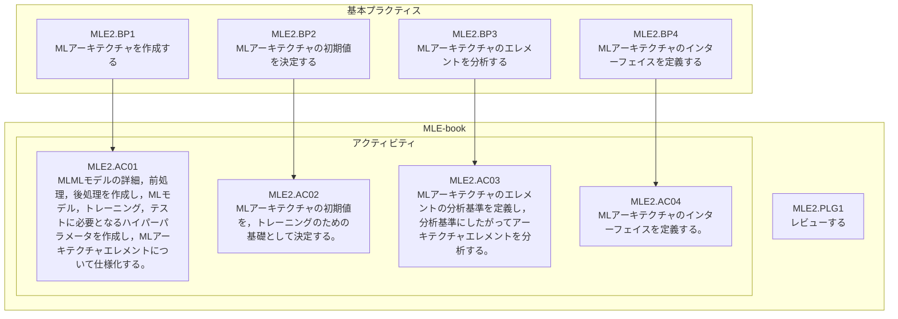

#### MLE2.アクティビティ01-ドメイン

| アクティビティID | アクティビティ内容    | タスクID       | タスク内容                      |
| --------- | ------------ | ----------- | -------------------------- |
| MLE2.AC01 | MLアーキテクチャを作成する | MLE2.TA0101 |MLモデルの前処理，処理，後処理について仕様化する。 |
|MLE2.AC01 | MLアーキテクチャを作成する | MLE2.TA0102 |MLアーキテクチャコンポーネントを検討する |
| MLE2.AC01 | MLアーキテクチャを作成する | MLE2.TA0103 |MLモデル，トレーニング，テストに必要となるハイパーパラメータについて仕様化する。 |
| MLE2.AC01 | MLアーキテクチャを作成する | MLE2.TA0104 |MLアーキテクチャエレメントについて仕様化する。 |

#### MLE2.アクティビティ02-ドメイン

| アクティビティID | アクティビティ内容    | タスクID       | タスク内容                      |
| --------- | ------------ | ----------- | -------------------------- |
| MLE2.AC02 | MLアーキテクチャの初期値を決定する | MLE2.TA0201 |MLE2.TA0102を確認する |
| MLE2.AC02 | MLアーキテクチャの初期値を決定する | MLE2.TA0202 |MLアーキテクチャのハイパーパラメータの初期値を決定する |

#### MLE2.アクティビティ03-ドメイン

| アクティビティID | アクティビティ内容    | タスクID       | タスク内容                      |
| --------- | ------------ | ----------- | -------------------------- |
| MLE2.AC03 | MLアーキテクチャのエレメントを分析する | MLE2.TA0301 |MLアーキテクチャのエレメントの分析基準を定義する。例えば信頼性，説明可能性など |
| MLE2.AC03 | MLアーキテクチャのエレメントを分析する | MLE2.TA0302 |MLアーキテクチャのエレメントを分析する。|

#### MLE2.アクティビティ04-ドメイン

| アクティビティID | アクティビティ内容    | タスクID       | タスク内容                      |
| --------- | ------------ | ----------- | -------------------------- |
| MLE2.AC04 | MLアーキテクチャのインターフェイスを定義する | MLE2.TA0401 |MLアーキテクチャのコンポーネントに基づき内部インターフェイスを決定する|
| MLE2.AC04 | MLアーキテクチャのインターフェイスを定義する | MLE2.TA0402 |MLアーキテクチャのコンポーネントに基づき外部インターフェイスを決定する|

#### MLE2.アクティビティ05-ドメイン

| アクティビティID | アクティビティ内容    | タスクID       | タスク内容                      |
| --------- | ------------ | ----------- | -------------------------- |
| MLE2.AC05 | MLアーキテクチャのリソース目標を定義する | MLE2.TA0501 |MLアーキテクチャのコンポーネントに基づきコンポーネントのリソース目標を決定する| 
| MLE2.AC05 | MLアーキテクチャのリソース目標を定義する | MLE2.TA0502 |MLアーキテクチャのコンポーネントに基づきトレーニングおよびデプロイ時のリソース目標を決定する| 

#### MLE2.アクティビティ06-ドメイン

| アクティビティID | アクティビティ内容 | タスクID       | タスク内容               |
| --------- | --------- | ----------- | ------------------- |
| MLE2.AC06 | レビュー      | MLE2.TA0601 | AC01のレビューを実施する |
| MLE2.AC06 | レビュー      | MLE2.TA0602 | AC02のレビューを実施する |
| MLE2.AC06 | レビュー      | MLE2.TA0603 | AC03のレビューを実施する |
| MLE2.AC06 | レビュー      | MLE2.TA0604 | AC04のレビューを実施する |
| MLE2.AC06 | レビュー      | MLE2.TA0605 | AC05のレビューを実施する |

#### MLE2.アクティビティ07-ドメイン

| アクティビティID |アクティビティ内容| タスクID     | タスク内容     	         |
| --------- | --------- | ------------ | ------------ |
| MLE2.AC07 | 双方向トレーサビリティ| MLE2.TA0701 | AC01の双方向トレーサビリティを確立する              |
| MLE2.AC07 | 双方向トレーサビリティ| MLE2.TA0702 | AC02の双方向トレーサビリティを確立する              |
| MLE2.AC07 | 双方向トレーサビリティ| MLE2.TA0703 | AC03の双方向トレーサビリティを確立する              |
| MLE2.AC07 | 双方向トレーサビリティ| MLE2.TA0704 | AC04の双方向トレーサビリティを確立する              |
| MLE2.AC07 | 双方向トレーサビリティ| MLE2.TA0705 | AC05の双方向トレーサビリティを確立する              |
| MLE2.AC07 | 双方向トレーサビリティ| MLE2.TA0706 | AC06の双方向トレーサビリティを確立する              |

#### MLE2.アクティビティ08-ドメイン

| アクティビティID |アクティビティ内容| タスクID     | タスク内容     	         |
| --------- | --------- | ------------ | ------------ |
| MLE2.AC08 | MLアーキテクチャの伝達 | MLE2.TA0801 | MLアーキテクチャの伝達 |

### SUP11-アクティビティ-ドメイン
| 基本プラクティスID | 基本プラクティス内容        | アクティビティID            | アクティビティ内容         |
| ---------- | ----------------- | -------------------- | ----------------- |
| SUP11.BP1  | ML データ管理システムの確立     | SUP11.AC01 | ML データ管理システムの確立 |
| SUP11.BP2  | ML データの品質アプローチの作成   | SUP11.AC02 | ML データの品質アプローチの作成 |
| SUP11.BP3  | ML データの収集           | SUP11.AC03 | ML データの収集 |
| SUP11.BP4  | ML データの処理           | SUP11.AC04 | ML データの処理 |
| SUP11.BP5  | ML データの品質保証         | SUP11.AC05 | ML データの品質保証 |
| SUP11.BP6  | 合意された処理済の ML データの伝達 | SUP11.AC06 | 合意された処理済の ML データの伝達 |

#### SUP11.アクティビティ01-ドメイン
| アクティビティID |アクティビティ内容| タスクID     | タスク内容     	         |
| --------- | --------- | ------------ | ------------ |
| SUP11.AC01 | MLデータ管理システムの確立 | SUP11.TA0101 |MLデータ管理活動について，データ収集を支援するためのMLデータ管理システムを検討する |
| SUP11.AC01 | MLデータ管理システムの確立 | SUP11.TA0102 |MLデータ管理活動について，データラベリングを支援するためのMLデータ管理システムを検討する |
| SUP11.AC01 | MLデータ管理システムの確立 | SUP11.TA0103 |MLデータ管理活動について，データアノテーションを支援するためのMLデータ管理システムを検討する |
| SUP11.AC01 | MLデータ管理システムの確立 | SUP11.TA0104 | MLデータ管理活動について支援するためのMLデータ管理システムを確立する |
| SUP11.AC01 | MLデータ管理システムの確立 | SUP11.TA0105 | MLデータに関連する情報源について支援するためのMLデータ管理システムを確立する |
| SUP11.AC01 | MLデータ管理システムの確立 | SUP11.TA0106 | ステータスモデルを含むMLデータのライフサイクルについて支援するためのMLデータ管理システムを確立する |
| SUP11.AC01 | MLデータ管理システムの確立 | SUP11.TA0107 | 影響を受ける関係者との窓口について支援するためのMLデータ管理システムを確立する |
*アノテーション：データにラベルを付与すること

#### SUP11.アクティビティ02-ドメイン
| アクティビティID |アクティビティ内容| タスクID     | タスク内容     	         |
| --------- | --------- | ------------ | ------------ |
| SUP11.AC02 | MLデータの品質アプローチの作成 | SUP11.TA0201 |MLデータ管理活動について，品質基準とデータ情報源の関連性を定義する |
| SUP11.AC02 | MLデータの品質アプローチの作成 | SUP11.TA0202 |MLデータ管理活動について，品質基準とラベリングの関連性を定義する |
| SUP11.AC02 | MLデータの品質アプローチの作成 | SUP11.TA0203 |MLデータ管理活動について，品質基準とアノテーションの関連性を定義する |
| SUP11.AC02 | MLデータの品質アプローチの作成 | SUP11.TA0204 | MLデータ管理活動についてデータのバイアスを回避するための支援活動を定義する |
| SUP11.AC02 | MLデータの品質アプローチの作成 | SUP11.TA0205 | MLデータ管理活動についてデータの品質基準を定義する |
| SUP11.AC02 | MLデータの品質アプローチの作成 | SUP11.TA0206 | MLデータ管理活動についてデータの品質基準に基づいて，分析できることを保証する |
| SUP11.AC02 | MLデータの品質アプローチの作成 | SUP11.TA0207 | MLデータ管理活動について，データのバイアスを回避できることを保証する |

#### SUP11.アクティビティ03-ドメイン
| アクティビティID |アクティビティ内容| タスクID     | タスク内容     	         |
| --------- | --------- | ------------ | ------------ |
| SUP11.AC03 | MLデータの収集 | SUP11.TA0301 |MLデータ管理活動について，生データに関連する情報源を識別する |
| SUP11.AC03 | MLデータの収集 | SUP11.TA0302 |MLデータ管理活動について，生データに関連する情報源の変化点を継続的に監視する |
| SUP11.AC03 | MLデータの収集 | SUP11.TA0303 |MLデータ管理活動について，生データを収集する |

#### SUP11.アクティビティ04-ドメイン
| アクティビティID |アクティビティ内容| タスクID     | タスク内容     	         |
| --------- | --------- | ------------ | ------------ |
| SUP11.AC04 | MLデータの処理 | SUP11.TA0401 |MLデータ管理活動について，生データに関連する情報源を識別する |
| SUP11.AC04 | MLデータの処理 | SUP11.TA0402 |MLデータ管理活動について，生データに関連する情報源の変化点を継続的に監視する |
| SUP11.AC04 | MLデータの処理 | SUP11.TA0403 |MLデータ管理活動について，生データを収集する |

#### SUP11.アクティビティ05-ドメイン
| アクティビティID |アクティビティ内容| タスクID     | タスク内容     	         |
| --------- | --------- | ------------ | ------------ |
| SUP11.AC05 | MLデータの品質保証 | SUP11.TA0501 |MLデータ管理活動について，品質アプローチに従って活動を実施する |
| SUP11.AC05 | MLデータの品質保証 | SUP11.TA0502 |MLデータ管理活動について，品質基準を満足していること保証する |

#### SUP11.アクティビティ06-ドメイン
| アクティビティID |アクティビティ内容| タスクID     | タスク内容     	         |
| --------- | --------- | ------------ | ------------ |
| SUP11.AC06 | 合意された処理済のMLデータの伝達 | SUP11.TA0601 |MLデータ管理活動について，合意された処理済みのMLデータについて，影響を受ける関係者へ伝達する |


| SUP11.AC06 | 合意された処理済のMLデータの伝達 | SUP11.TA0601 |MLデータ管理活動について，合意された処理済みのMLデータについて，影響を受ける関係者へ伝達する |

### MLE3-アクティビティ-ドメイン
| 基本プラクティスID | 基本プラクティス内容 | アクティビティID | アクティビティ内容 |
| :--- | :--- | :--- | :--- |
| MLE3.BP1 | MLモデルをトレーニングする | MLE3.AC01 | MLモデルのトレーニングを実施する |
| MLE3.BP2 | MLモデルを検証する | MLE3.AC02 | トレーニング結果の妥当性を検証する |
| MLE3.BP3 | 双方向トレーサビリティを確立する | MLE3.AC03 | アーキテクチャとモデルのトレーサビリティ |
| MLE3.BP4 | トレーニング結果を伝達する | MLE3.AC04 | トレーニング結果の伝達 |

### MLE4-アクティビティ-ドメイン
| 基本プラクティスID | 基本プラクティス内容 | アクティビティID | アクティビティ内容 |
| :--- | :--- | :--- | :--- |
| MLE4.BP1 | MLテストを仕様化する | MLE4.AC01 | MLテストの仕様化 |
| MLE4.BP2 | MLテストを選定する | MLE4.AC02 | MLテストの選定 |
| MLE4.BP3 | MLモデルをテストする | MLE4.AC03 | MLモデルのテスト実施 |
| MLE4.BP4 | MLモデルを検証する | MLE4.AC04 | テスト結果に基づくモデル検証 |
| MLE4.BP5 | 双方向トレーサビリティを確立する | MLE4.AC05 | 要求とテストのトレーサビリティ |
| MLE4.BP6 | テスト結果を伝達する | MLE4.AC06 | テスト結果の伝達 |

# MLE-bookバージョン情報
|バージョン情報|更新内容|更新日時|
| --- | --- | --- |
| 0.3.0 | MLE3, MLE4の追加 | 2026-03-16 |
| 0.2.0 | SUP11の追加 | 2026-03-15 |
| 0.1.0 | 初版作成 | 2026-03-09 |
