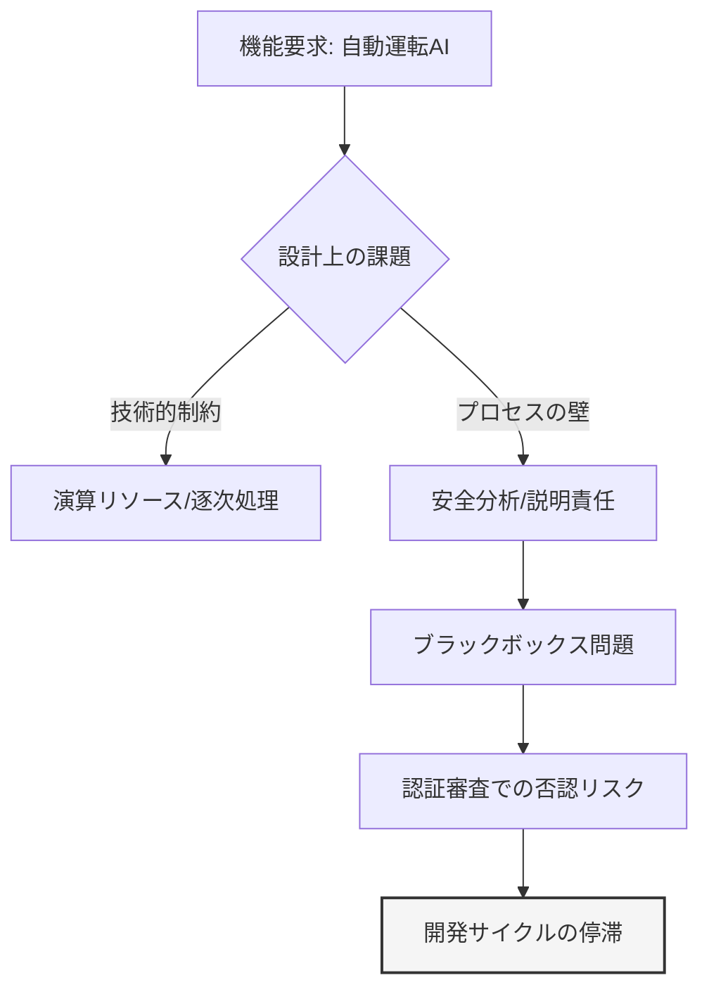
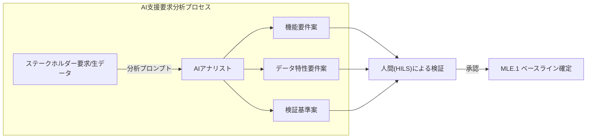
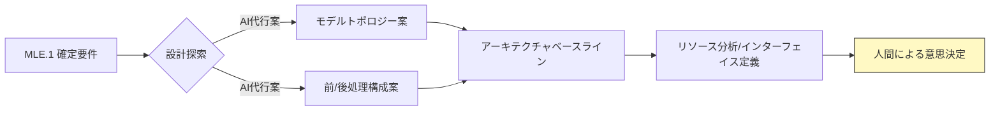
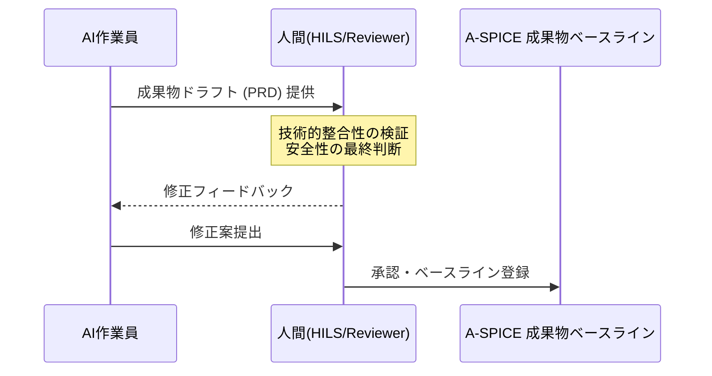

# AI搭載ではなくAI活用！A-SPICE 4.0 MLEの実戦デザイン
## プロセスへのAI統合による工学的最適化と破綻しない準拠戦略

---

# イントロダクション：Automotive SPICE 4.0 MLEプロセスの実戦的解釈

## 1. 背景：車載ソフトウェア開発におけるMLEプロセスの導入

車載システムの高度化に伴い、機械学習（ML）技術の適用が不可欠となっています。これを受け、Automotive SPICE (A-SPICE) 4.0では「MLE（機械学習エンジニアリング）」プロセス群を新設しました。

しかし、多くの開発現場では、このMLEプロセスの適用に関して大きな混乱が生じています。具体的には、規格が求める要求分析、アーキテクチャ設計、トレーニング、検証といった一連のプロセスを、「車両の安全制御機能に直接MLモデルを組み込むこと」を前提としたものと誤認し、ASIL（安全整合性レベル）の達成とプロセス遵守の板挟みによって、プロジェクトの実行可能性が著しく低下している現状があります。

## 2. 課題：生成AIによる規格解析の限界と誤解

この混乱の原因の一つは、規格の文言に対する解釈の固定化にあります。実際に、生成AIを用いて A-SPICE 4.0 PAMを解析した場合でも、「MLEプロセスは、開発対象の機能にAIを搭載するためのプロセスである」という回答が優先的に出力されます。

しかし、Safety-Criticalな組込制御においては、現時点でのMLモデルの決定論的説明性の欠如が、認証上の致命的なリスクとなります。

## 3. 本書の目的：開発プロセスへのAI統合によるテーラリングの最適化

本書は、MLEプロセスを「機能へのAI搭載」ではなく、**「開発プロセスにおけるAI活用」**へとテーラリングすることを提唱します。

規格の意図を汲み取りつつ、以下の3点を柱として実戦的なガイドラインを提示します。

1.  **プロセステーラリングの論理構成**: 規格の基本プラクティス（BP）を、AIによる開発支援タスク（TA）へ再定義する。
2.  **生成AIによる成果物生成の自動化**: 要求分析やトレーサビリティ確立など、工数負荷の高い作業にAIを統合し、プロセス品質を維持しつつ開発スピードを向上させる。
3.  **Human-in-the-Loop (HILS) 戦略**: AIの出力を人間が検証・承認する構造を明確化し、最終的な製品品質と説明責任を担保する。

本書を通じて、A-SPICE 4.0 MLEを「準拠すべき負担」から「開発効率を最大化するためのフレームワーク」へと昇華させるための具体的知見を提供します。

---

# 第1章：MLEプロセスにおけるパラダイムシフト —— プロダクトAIからプロセスAIへ

## 1. 組込制御における機械学習適用の制約事項

自動運転等の高度な機能要求に対し、従来のIF-THEN形式のロジックでは限界が生じています。しかし、車載組込システムには以下の厳しい制約が存在します。

- **説明責任 (Accountability)**: 特定の出力に至った論拠を設計レベルで説明可能であること。
- **決定論的挙動**: 同一入力に対して常に同一の結果を保証すること。
- **リソース制約**: 厳しいリアルタイム性と、限定された演算リソース。

これらの制約下で、ブラボックボックス性を有するMLモデルを機能の中核（制御ループ内）に配置することは、現行の安全性標準（ISO 26262等）に照らして極めてリスクが高く、実用化には多大な検証コストを要します。



## 2. テーラリング概念の再定義：プロセスAIの導入

本書が提唱するのは、MLの適用先を「プロダクト（機能）」から「プロセス（開発手法）」へシフトさせるアプローチです。これを「プロセスAI」と呼びます。

| 比較項目 | プロダクトAI（機能搭載） | プロセスAI（開発活用） |
| :--- | :--- | :--- |
| **適用スコープ** | 制御アルゴリズム、認識部等 | 要求分析、設計支援、検証自動化等 |
| **品質責任** | モデル自体の精度が安全を左右 | **最終成果物を人間が承認することで担保** |
| **A-SPICE準拠** | MLEプロセスの全要件審査 | AIによる成果物（PRD）の品質審査 |
| **導入可能性** | 認証コストにより限定的 | **既存プロセスへの統合が容易** |

プロセスAIアプローチでは、AIは成果物の「ドラフト生成エンジン」として機能します。出力された成果物は既存の品質管理ワークフロー（レビュー、検証）を経るため、安全プロセスとの整合性が完全に保たれます。

## 3. 実装上の利点：トレーサビリティと効率性の両立

プロセスへのAI統合は、単なる省人化に留まらず、規格が求める品質レベルの向上に寄与します。

1.  **高精度なマッピング**: 数千におよぶ要求項目間の関連性を、自然言語処理（NLP）を用いて自動抽出。
2.  **一貫性の自動検証**: 要求、設計、テストコード間の論理性矛盾を定常的に監視。
3.  **エビデンスの即時生成**: 開発付随作業（ドキュメント作成）のリードタイムを短縮。

## 4. 運用ルールの策定：HILS (Human-in-the-Loop Strategy)

このパラダイムシフトを実現するには、以下の運用ルールを定義する必要があります。

- **AI解放領域の特定**: 安全に直結しない付随プロダクト（仕様書案、テスト記述等）を対象とする。
- **Human-in-the-Loop (HILS) の義務化**: AIの出力をそのまま「正」とせず、必ず資格を持つエンジニアによる承認ステップを設ける。

## 章のまとめ

機能搭載の困難さを克服するためには、開発プロセスそのものにAIを組み込むことが、現実的なMLEプロセス適用の解となります。次章より、各プロセスにおける具体的な適用手法について詳説します。

---

# 第2章：MLE.1 機械学習要求分析 —— 生成AIによる要求分解と構造化

## 1. MLE.1 プロセスの目的と課題

MLE.1「機械学習要求分析」の目的は、ステークホルダー要求を、機械学習に関連するシステム要求へと詳細化・仕様化することです。これには、以下のBP（基本プラクティス）の遵守が求められます。

- **BP.1 要求の仕様化**: 具体的な属性を持つ要件への落とし込み。
- **BP.3 要求の分析**: 実現可能性と検証可能性の評価。
- **BP.4 双方向トレーサビリティの確立**: 顧客要求からML要求への紐付け。

従来のエンジニアリング手法では、これらのプロセスは膨大な手作業に依存しており、要求の解釈の不一致やトレーサビリティの欠落が頻発していました。

## 2. 解決策：AI駆動型要件定義ワークフロー

MLE.1におけるアクティビティを、AI支援型へと移行させるための設計指針を提示します。



### 2.1 要求の自動取得と分解 (AC01: TA0101, TA0102)
自然言語処理タスクとして、非構造化データ（打合せ議事録、顧客仕様書）から、MLE固有の要件を自動抽出します。AIには「A-SPICE準拠のシステムエンジニア」として、要件を「ID」「概要」「成功基準」「制約条件」の形式で出力する役割を持たせます。

### 2.2 実現・検証可能性の評価 (AC02: TA0201-0205)
抽出された要求に対し、AI、またはAIが生成した評価スクリプトを用いて、モデルの収束性や推論リソースの妥当性を「プレ分析」させます。人間は、AIが提示したリスク項目を精査し、最終的な優先順位付け（TA0205）を行います。

## 3. 双方向トレーサビリティの自動構築 (AC04: TA0401)

MLE.1の最重要成果物の一つである「一貫性の証拠」を、AIによって自動生成します。AIは、要求項目間の意味的類似度（Semantic Similarity）を計算し、RMT (Requirements Traceability Matrix) のドラフトを提示します。

これにより、人間は「紐付ける作業」から「紐付けの妥当性を判断する作業」へと役割を変更することが可能になり、トレーサビリティの網羅性が向上します。

## 4. 実務への適用ガイドライン

1.  **プロンプトによる品質の標準化**: 誰が実行しても同等の分解精度が得られるよう、A-SPICE準拠プロンプトをプロセス資産として管理する。
2.  **AIの分析結果のセカンドオピニオン活用**: AC03（レビュー）において、AIに「この要求定義における矛盾点や、テスト不可能な箇所の指摘」をさせて品質を担保する。

## 章のまとめ

MLE.1におけるAIの活用は、単なる工数削減ではなく、要件の網羅性とトレーサビリティの論理性という、プロセス品質の核心を強化するものです。
次章では、これら要件を具体化するアーキテクチャ設計におけるAI統合について述べます。

---

# 第3章：MLE.2 機械学習要求アーキテクチャ —— AIベースの設計支援と整合性検証

## 1. MLE.2 プロセスの位置付けと工学的課題

MLE.2「機械学習要求アーキテクチャ」は、MLE.1で定義された要件を、具体的なMLモデル構成、パラメータ、およびそれらの入出力インターフェイスに落とし込むプロセスです。



主なBPは以下の通りです。

- **BP.1 MLアーキテクチャの作成**: モデル構造、前処理、後処理の定義。
- **BP.4 インターフェイスの定義**: コンポーネント間のデータフローの明文化。
- **BP.5 リソース目標の定義**: 消費メモリ、計算能力（TOPS等）の割り当て。

MLアーキテクチャ設計は、探索空間が極めて広く、トレードオフ分析（精度 vs 効率）が複雑化するため、属人的な判断に頼らざるを得ないという課題がありました。

## 2. 解決策：AIコンサルティングによるアーキテクチャ最適化

設計フェーズにAIを統合し、定性的・定量的な設計判断を支援するワークフローを構築します。

### 2.1 アーキテクチャ構成案の動的生成 (AC01: TA0101-0104)
要求（MLE.1）を入力として、既存の最適なモデルトポロジー案を複数提示させます。
AIに「推論遅延を最小に抑えつつ、認識精度を維持するため」の最適な「前処理・後処理パイプライン」のドラフトを作成させ、これを設計の第1次ベースラインとします。

### 2.2 アーキテクチャエレメントの多角的な分析 (AC03: TA0301-0302)
A-SPICEが求める「分析」において、AIに「堅牢性」「説明可能性」「リソース消費」といった複数の評価軸から、設計案のリスク分析を行わせます。特に、ハイパーパラメータの初期値決定（AC02）において、統計的な根拠に基づいた推奨値をAIに提示させることで、トレーニングフェーズの収束性を向上させます。

## 3. インターフェイス定義とリソース消費の整合性担保 (AC04, AC05)

アーキテクチャ設計における致命的なエラーは、インターフェイス不整合やリソース予算の超過です。

- **インターフェイスの自動ドキュメント化**: AIに各モジュール間の「データ型」「次元」「タイミング要件」を記述させ、一貫性を自動チェック（Linter的活用）します。
- **リソース配分のシミュレーション**: AIを用いて、ターゲットハードウェアにおける推定計算負荷を算出し、リソース目標（TA0501）の妥当性を評価します。

## 4. 実務への適用ガイドライン

1.  **AI案に対する複数の評価軸（Criteria）の設定**: 単一の推奨案ではなく、バランスの異なる複数の構成案をAIに提示させ、人間が最終的なトレードオフ判断を行う。
2.  **設計根拠（Rationale）の自動生成**: なぜそのアーキテクチャを選択したかという論理的根拠をAIにドラフトさせ、審査時の説明エビデンスとして活用する。

## 章のまとめ

MLE.2におけるAIの役割は、膨大な探索空間のナビゲーターです。AIが提供する候補案と分析結果を人間が吟味することで、工学的妥当性と高いパフォーマンスを両立させたアーキテクチャを効率的に構築可能となります。
次章では、これら設計を支える「データの品質管理（SUP.11）」について論じます。

---

# 第4章：SUP.11 機械学習データ管理 —— データ品質の自律的統制とライフサイクル管理

## 1. SUP.11 プロセスにおける「データ＝仕様」の概念

MLシステムにおいては、学習データが製品の振る舞いを決定する「動的な仕様」となります。そのため、A-SPICE 4.0 SUP.11は、以下のBPを通じてデータの厳格な管理を求めています。

- **BP.2 品質アプローチの確立**: データの品質基準とバイアス回避策の定義。
- **BP.4 データの処理**: ラベリングやメタデータ付与の整合性確保。
- **BP.5 データの品質保証**: 定義された基準に対する適合性の検証。

従来のソフトウェア開発における構成管理とは異なり、SUP.11では「データの意味的妥当性」の担保に膨大な工数を要します。

## 2. 解決策：AIによるデータガバナンスの自動化

情報の巨大化に対応するため、データサイクル全体にAIを「ガーディアン（監査者）」として配置します。

```mermaid
flowchart TB
    subgraph SUP.11 管理サイクル
    A[データ収集] --> B[処理/アノテーション]
    B --> C[品質検証/監査]
    C --> D[伝達/合意]
    end
    
    subgraph "AI支援 (自律型統制)"
    E[バイアス自動検知エンジン] -.-> B
    F[アノテーション不突合検知] -.-> C
    G[品質レポート自動生成] -.-> D
    end
    
    style SUP.11 管理サイクル fill:#f9f9f9
    style "AI支援 (自律型統制)" fill:#e1f5fe
```

### 2.1 データ品質基準とバイアス検出 (AC02, AC05)
AIを用いて、収集されたデータセット（AC03）の統計的分布を分析します。特定条件（照明、天候、地理的要因等）の偏り（バイアス）を自動検出し、追加収集の必要性を定量的に示唆します。

### 2.2 アノテーションの品質監査 (AC04)
人間によるアノテーション作業（TA0102）のミスを、AIによる「相互検証（Cross-validation）」で抽出します。人間とAIの結果が矛盾するサンプルのみを抽出し、人間が再評価（HILS）することで、効率的にデータ信頼性を向上させます。

## 3. エビデンスに基づいたデータの合意と伝達 (AC06)

SUP.11の最終目標は、関係者に対して「このデータは信頼できる」という証拠（PRD5）を示すことです。AIは、データ収集から処理、検証までのログを統合し、「データセット仕様書（Data Sheet for Datasets）」の形式で証跡を自動生成します。

これにより、監査時の説明責任が強力にサポートされます。

## 4. 実務への適用ガイドライン

1.  **データ品質基準（Metric）の数式化**: 「十分な品質」といった抽象的な表現を避け、AIで測定可能な定量指標を品質アプローチ（AC02）で定義する。
2.  **変化点管理（Change Management）へのAI活用**: データソース（センサー特性等）の変化を定常的にAIで監視し、回帰トレーニングが必要なタイミングを自動通知する。

## 章のまとめ

SUP.11におけるAI活用は、データの「質」をエンジニアリングとして制御するための不可欠な手段です。次章では、これらAIプロセスを人間がどう統制するか、組織的なプラグイン戦略について述べます。

---

# 第5章：プラグイン戦略 —— HILS (Human-in-the-Loop Strategy) による統制

## 1. AI活用プロセスにおける「責任（Responsibility）」の定義

本資料で提示してきたAI駆動型プロセスにおいて、AIはあくまで「効率化のための手段（Enabler）」であり、最終的な「設計の妥当性」および「製品の安全性」を決定する主体ではありません。



A-SPICE準拠における説明責任（Accountability）を果たすために、AIの出力を、定義されたプロセスにプラグインとして組み込む「HILS (Human-in-the-Loop Strategy)」が必須となります。

## 2. 統制フレームワーク：MLE.PLG1 (レビュープラグイン)

すべてのAI支援タスクの出口には、必ず人間による検証（Verification）ステップを「プラグイン」として配置します。

### 役割分担の原則
- **AIの役割**: データの処理、パターンの抽出、成果物ドラフトの生成、機械的な整合性チェック。
- **人間の役割**: AI案のコンテキスト確認、安全意図の適合性判断、例外的なリスクの評価。

### 実装例：AC03/AC06における審査構造
ドラフトのアクティビティ図（図3-2）に示された通り、レビュー（AC）はAIのタスクからは独立し、上位のアクティビティとして人間が担当します。人間がAIの「出力結果」だけで用いるのではなく「出力に至ったプロンプトや根拠」をレビュー対象に含めることで、プロセスの妥当性が担保されます。

## 3. 組織的なインフラとしてのHILS

AIプロセスを単なる個人の試行錯誤から「組織的な標準プロセス」へ昇格させるための要件を整理します。

1.  **承認権限の厳格化**: プロセスステータスの遷移（ベースライン確定等）は、AIではなく、権限を持つエンジニアの署名を必須とする。
2.  **AIの不確実性の管理**: AIの出力が「推定」であることを明示し、人間が修正を加えた箇所を差分（Diff）として履歴管理する。
3.  **審査官（Assessor）への説明ロジック**: 「AIを使ったから効率的だ」ではなく、「AIをこのように使い、人間がこのように検証したから、従来よりも品質が高い」という説明論理（Safety Case的なアプローチ）を構築する。

## 4. エンジニアに求められるスキルの変容

プロセスAI時代において、エンジニアには以下の能力が求められます。
- **指示・設計能力**: AIへ最適な入力を与え、目的の成果物を引き出す能力。
- **検証・批判能力**: AIの出力に含まれる「微細な論理的矛盾」や「現状の制約への不適合」を見抜く力。

## 章のまとめ

プラグイン戦略とは、AIの力を最大限に引き出しつつ、人間の知性と責任によってそれを「工学的（Engineering）」にコントロールするための仕組みです。この統制があって初めて、AIは真にA-SPICE 4.0の準拠を支える「武器」となります。

---

# 結論：高効率かつ高品質なMLEプロセス準拠の実現

## 1. Automotive SPICE 4.0 MLEへの現実的アプローチ

本書では、A-SPICE 4.0で新たに定義されたMLEプロセスを、車載組込開発の厳しい制約下でいかに現実的に運用するかについて述べました。

結論として、**「AIを搭載するためのプロセス」ではなく「AIでプロセスを実行する」**というパラダイムシフトが、リソース制約の強い現在の開発環境における唯一の解となります。

## 2. 実践によるベネフィットの要約

本書のフレームワークを導入することで、以下の戦略的優位性が得られます。

- **開発リードタイムの短縮**: 要求分析（MLE.1）や設計（MLE.2）のドラフト生成をAIが担うことで、上流工程の工数を30%以上削減可能。
- **品質の客観的担保**: データガバナンス（SUP.11）におけるAI監査により、人間の主観に寄らないバイアス検出と品質保証を実現。
- **説明責任の強化**: AIが生成する詳細なトレーサビリティと分析エビデンスにより、認証やアセスメントに対する準備コストを大幅に抑制。

## 3. 次世代の標準プロセスに向けて

A-SPICE 4.0の登場は、単なる規格の更新ではなく、ソフトウェア開発のあり方そのものの変革を求めています。

私たちが目指すべきは、規格の文言に従順に従うことではなく、規格が求める「品質の意図」を最新のテクノロジーで合理的に達成することです。AIをプロセスの設計・実行のパートナーとして受け入れ、人間がその「指揮者」として責任を負う姿こそが、これからのエンジニアリングの標準となります。

本書が、あなたの現場において、MLEプロセスの準拠を形骸化させず、真にプロダクト品質を高めるための道標となれば幸いです。

**「規格を遵守するために立ち止まるのではなく、AIと共に、より高い品質の地平へと加速せよ。」**

---

# 付録：MLEプロセスのためのAIプロンプト・ライブラリ

本書で提唱した「プロセスAI」アプローチを具体化するための、生成AI（LLM）用プロンプトの設計指針とテンプレートを提示します。

## 1. MLE.1 要求分析用プロンプト (要求分解・構造化)

**目的**: 非構造化データからA-SPICE準拠の要求定義ドラフトを生成する。

```markdown
# Role
あなたは車載ソフトウェアのシニア要求エンジニアであり、Automotive SPICE 4.0 MLEプロセスの専門家です。

# Context
以下の[入力データ]は、顧客との打合せ議事録および暫定仕様メモです。これらを解析し、MLE.1 準拠の「機械学習要求」へと分解してください。

# Constraints
- 各要件には一意のID（MLE1_REQ_XXX）を付与すること。
- 要件は「概要」「背景/目的」「成功基準（Acceptance Criteria）」「ASIL/安全制約」「検証方法案」の項目で記述すること。
- 特に、ML固有の要件（データ品質、推論遅延、認識精度等）に注目して抽出すること。

# Input Data
[ここに議事録やメモを貼り付け]
```

## 2. MLE.2 アーキテクチャ設計用プロンプト (トレードオフ分析)

**目的**: 定義された要求に対し、技術的トレードオフを考慮した設計案を提示させる。

```markdown
# Role
あなたは車載AIシステムアーキテクトです。ターゲットハードウェアのリソース制約を考慮した最適なMLパイプラインの設計を行います。

# Task
以下の[要件リスト]に基づき、最適なアーキテクチャ案を3つ提示し、それぞれのメリット・デメリットを評価してください。

# Evaluation Criteria
1. 推論レイテンシ（リアルタイム性）
2. メモリ消費量（ROM/RAM）
3. 説明可能性 (Explainability)
4. 実装の堅牢性

# Input Data
[要件リストを貼り付け。リソース制約情報も含むこと]
```

## 3. SUP.11 データ管理用プロンプト (バイアス監査)

**目的**: データセットの属性情報から、A-SPICEが求める品質リスクを抽出する。

```markdown
# Role
あなたはMLデータ品質保証管理職（DQAM）です。

# Context
本プロジェクトでは、[対象ドメイン: 例: 自動駐車]のMLモデルを開発しています。
以下の[データセット統計情報]を確認し、SUP.11が求める「バイアス回避」および「品質基準」の観点からリスク分析を行ってください。

# Output
- 検出された可能性のあるバイアス（天候、時間、地理的偏り等）
- 追加収集が必要なシナリオの提案
- ラベリング整合性チェックのためのサンプリング戦略
```

## 4. プロンプト運用のコツ (Tips)

1.  **逐次実行 (Chain of Thought)**: 一度にすべてを生成させるのではなく、「まずは要件をリストアップせよ」「次に各要件の検証可能性をレビューせよ」というように、ステップを分けることで精度が向上します。
2.  **Few-shot プロンプティング**: 過去の良好な要求定義の例（1-2件）を「参考例」として与えることで、組織の標準フォーマットに沿った出力が得られやすくなります。
3.  **HILSログの保存**: AIへのプロンプトと、それに対する人間の修正記録を併せて保存することで、プロセス改善のための重要なエビデンス（プロセス資産）となります。
