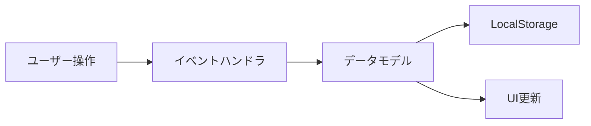

# MLE2: 機械学習アーキテクチャ — SUP11 MLデータ管理GUI

## AC01: アーキテクチャ作成

### パイプライン

### コンポーネント

| コンポーネント | 責務 |
|---|---|
| **TaskDataModel** | SUP11の全タスクデータ定義・状態管理 |
| **StorageManager** | LocalStorage読み書き・JSONエクスポート |
| **TabNavigator** | AC01〜AC06タブ切替 |
| **TaskCardRenderer** | タスクカードUI描画（チェック・メモ・日時） |
| **ProgressTracker** | 全体進捗計算・プログレスバー更新 |

## AC02〜AC05: 初期値・分析・IF・リソース

- **初期値**: 全タスク未完了、メモ空欄
- **分析**: 単一ファイル設計のため保守性◎
- **IF**: ユーザー→HTML（ブラウザ）、データ→LocalStorage
- **リソース**: <1MB、即時レスポンス

## AC06〜AC08: レビュー・トレーサビリティ・伝達

全AC合格。実装へ伝達。
